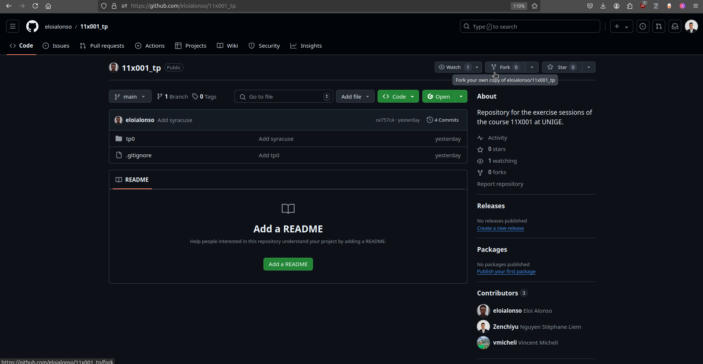
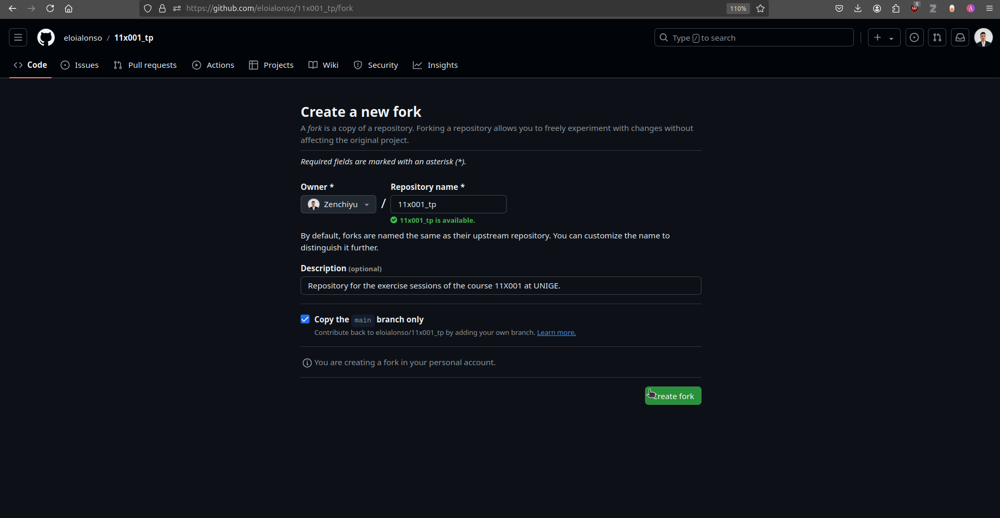
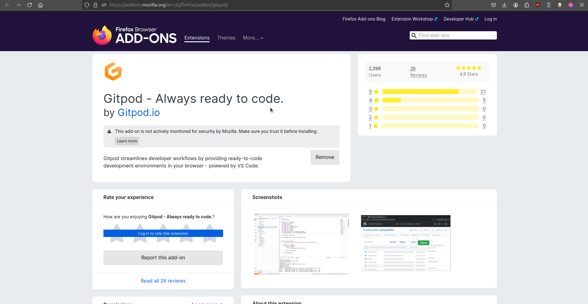
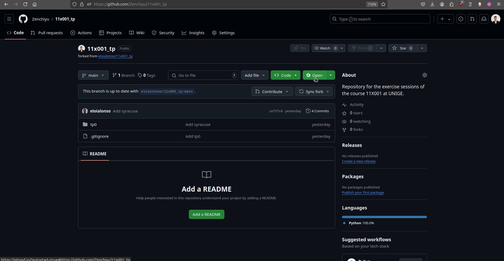
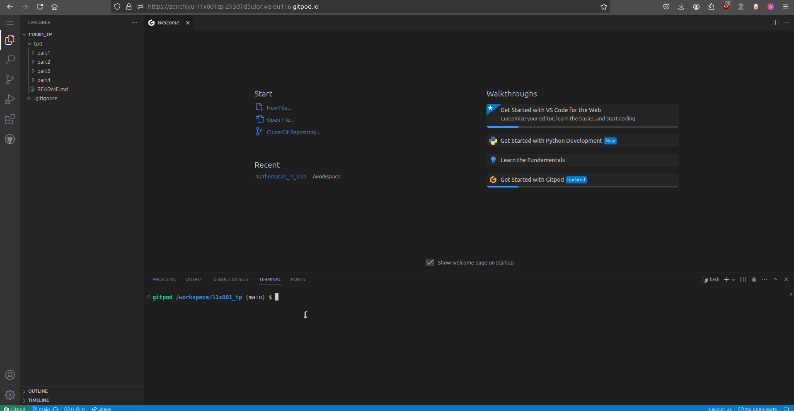

## Instructions pour bien commencer les TPs

### Option locale (recommandée)

- Si vous êtes sur Windows, commencez par installer [WSL avec Ubuntu](https://documentation.ubuntu.com/wsl/en/latest/guides/install-ubuntu-wsl2/)
- On vous recommande VSCode comme éditeur de texte, clang comme compilateur C, et miniconda pour gérer votre environnement Python.

### Option cloud - GitPod

<details>
    <summary>Détails d'installation</summary>
    
- Créez un compte [gitpod](https://www.gitpod.io/) (try for free, vous aurez normalement 50h par mois)
- Créez un compte [GitHub](https://github.com/) et si GitPod vous demande un compte linkedin, vous pouvez aussi en créer un.
- Allez sur la [page GitHub](https://github.com/eloialonso/11x001_tp) des exercices si pas déjà fait, puis `forker` le `repository` comme indiqué comme suit:




- Ajoutez ensuite l'extension GitPod sur votre navigateur ([Firefox](https://addons.mozilla.org/en-US/firefox/addon/gitpod/), [Chrome](https://chromewebstore.google.com/detail/gitpod/dodmmooeoklaejobgleioelladacbeki?hl=fr)):



#### Chaque semaine

- Vous pouvez ensuite accéder à l'éditeur de texte en cliquant sur ce bouton:



- Ce qui ouvre ceci:



- Et lorsque vous avez fini de travailler, **veillez à stopper vos workspaces quand vous ne les utilisez pas!**


</details>

## Quelques commandes utiles dans le terminal

- Se déplacer dans le filesystem : `cd <chemin>`
- Revenir un répertoire au dessus : `cd ..`
- Voir les fichiers présents dans le répertoire courant : `ls` ou `ll`
- **Lancer un code C** :
    - Compiler votre code source avec `clang <nom>.c -o <nom_executable>`
    - Exécuter avec `./<nom_executable>`
- **Lancer un code Python** : `python <nom>.py`

### Mettre à jour votre fork avec les fichiers du repository principal

Pour récupérer les nouveaux fichiers et éventuellement résoudre les conflits à partir de l'upstream, vous devez faire ce qui suit :

1. **Récupérer les mises à jour de l'upstream** :

   ```bash
   git fetch upstream

2. **Fusionner les changements dans votre branch actuelle** :

    ```bash
    git merge upstream/main

Il faudra sûrement résoudre des conflits...

Si des conflits surviennent, vous devrez les résoudre manuellement. Voici quelques commandes utiles pour gérer les conflits :

- **Voir les fichiers en conflit** :
  ```bash
  git status
  ```

- **Ouvrir un fichier en conflit dans un éditeur de texte** (remplacez `<fichier>` par le nom du fichier en conflit) :
  ```bash
  code <fichier>
  ```

- **Restaurer un fichier à sa version précédente (avant le conflit)** :
  ```bash
  git restore --staged <fichier>
  ```

- **Ajouter un fichier une fois le conflit résolu** :
  ```bash
  git add <fichier>
  ```

- **Terminer le processus de fusion après avoir résolu tous les conflits** :
  ```bash
  git commit -m "Résolution des conflits"
  ```

- **Pour mettre les modifications du répositoire sur le github, il faut faire** :
  ```bash
  git push origin main
  ```
